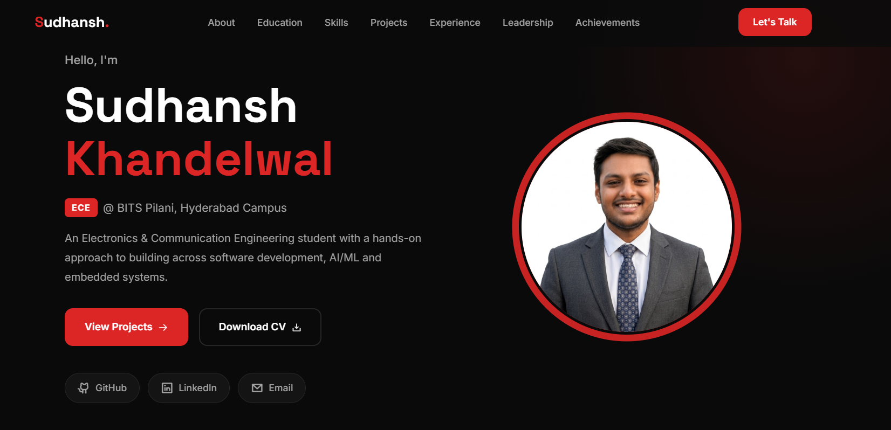

# 🚀 Personal Portfolio — Sudhansh Khandelwal

A modern, dark-themed personal portfolio website built with vanilla HTML, CSS, and JavaScript.



## 🔗 Live Demo

- **Netlify:** [Coming Soon](#)
- **GitHub Pages:** [https://sudhansh81205.github.io/Personal_Portfolio/](https://sudhansh81205.github.io/Personal_Portfolio/)

## ✨ Features

- **Dark Theme** with crimson red accent palette
- **Fully Responsive** — desktop, tablet, and mobile
- **Smooth Animations** — scroll-based reveals, hover effects, animated counters
- **Clean UI** — modern cards, timeline components, skill badges
- **Fast Loading** — no frameworks, no build tools, pure static files
- **SEO Friendly** — semantic HTML, meta tags, Open Graph

## 📂 Project Structure

```
Personal_Portfolio/
├── index.html          # Single-page portfolio (all sections)
├── css/
│   └── style.css       # Complete stylesheet (dark theme, responsive)
├── js/
│   └── main.js         # Animations, navigation, scroll effects
├── assets/
│   └── photo.jpg       # Profile photo
└── resume.pdf          # Downloadable resume
```

## 🛠️ Tech Stack

| Technology | Purpose |
|------------|---------|
| HTML5 | Semantic structure |
| CSS3 | Styling, animations, responsive design |
| JavaScript | Scroll reveals, mobile nav, counters |
| Google Fonts | Inter + Space Grotesk typography |
| Phosphor Icons | Lightweight icon set |

## 📋 Sections

1. **Hero** — Introduction with photo, CTAs, and social links
2. **About Me** — Background and interests
3. **Education** — Academic timeline (BITS Pilani, Class XII, Class X)
4. **Skills** — Categorized technical proficiency
5. **Projects** — RISC-V Processor, Limit Order Book, ML Salary Prediction
6. **Experience** — CSIR-CEERI Jaipur internship
7. **Leadership** — Coordinator (Ultimate Frisbee), POC (Inter-BITS Sports Fest)
8. **Achievements** — JEE Mains, JEE Advanced, BITSAT scores
9. **Resume** — Download button
10. **Contact** — Email, Phone, GitHub, LinkedIn

## 🚀 Deployment

### GitHub Pages
1. Go to repo **Settings** → **Pages**
2. Source: **Deploy from branch** → Branch: **main** → Folder: **/ (root)**
3. Save — site goes live in ~1 minute

### Netlify
1. Sign in at [app.netlify.com](https://app.netlify.com) with GitHub
2. **Add new site** → **Import an existing project** → Select this repo
3. Deploy with default settings (no build command needed)

## 🔧 Customization

All content is in plain HTML inside `index.html`. To update:

- **Projects** — Edit the `.project-card` blocks
- **Skills** — Edit the `.skill-card` blocks
- **Experience** — Edit the `.experience-card` block
- **Colors** — Change CSS custom properties in `:root` at the top of `style.css`

## 📬 Contact

- **Email:** f20240255@hyderabad.bits-pilani.ac.in
- **LinkedIn:** [Sudhansh Khandelwal](https://www.linkedin.com/in/sudhansh-khandelwal-82b318192/)
- **GitHub:** [sudhansh81205](https://github.com/sudhansh81205)

---

Built with ❤️ by Sudhansh Khandelwal
